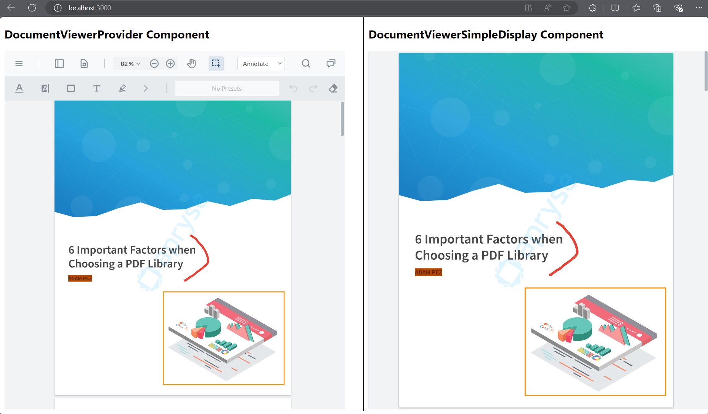

# WebViewer in React Using Context APIs

A React component for displaying documents in your React app. It is developed with Apryse's [WebViewer](https://docs.apryse.com/documentation/web/) library & [React context APIs](https://react.dev/learn/passing-data-deeply-with-context). The sample project wraps the WebViewer inside a React component and allows control over the WebViewer instance everywhere in the app. Do you want to handle the document inside you cool modal component? No problem, this sample project will help you simplify the process using Context API components.



## Run the demo locally

To run the demo locally clone the repo and within your own react project, use the `<DocumentViewerProvider/>` or `<DocumentViewerSimpleDisplay/>` snippet to call a sample component.


This repo is specifically designed for users interested in integrating a WebViewer instance into a React project. This project was generated with an `npx` Create React App command. 

```
npx create-react-app webviewer-react --template typescript
```

## Initial setup

Before you begin, make sure your development environment includes [Node.js and npm](https://www.npmjs.com/get-npm).


1. [Node.js](https://nodejs.org/en).
2. IDE used in this sample is Visual Studio Code with an NPM extension to process commands within its terminal.
3. [GitHub command line](https://github.com/git-guides/install-git) `git`.

Inside your project at the level where your `package.json` exists, install the `webviewer` package.

```
npm i @pdftron/webviewer
```

Clone the repo to get the components to add them to your project.

```
git clone https://github.com/PDFTron/webviewer-react.git

```

## Context API Components

Inside the app's component there are calls to two components: 

* `DocumentViewerProvider`
* `DocumentViewerSimpleDisplay`

```
//src/App.tsx

import React from 'react';
import './App.css';
import DocumentViewerProvider from './components/DocumentViewer';
import DocumentViewerSimpleDisplay from './components/DocumentViewerSimpleDisplay';


function App() {
  return (
    <div className='App'>

      <div className='topHalf'>
      <h2> DocumentViewerProvider Component</h2>
        <DocumentViewerProvider className='documentViewerProvider' path={''}/>
      </div>

    <div className='bottomHalf'>
    <h2> DocumentViewerSimpleDisplay Component</h2>
     <DocumentViewerSimpleDisplay className='documentViewerSimpleDisplay' path={''}/>
    </div>
   </div>
  );
}
```

You will need to copy the library assets from `./node_modules/@pdftron/webviewer/public` and place them at a location where you are able to serve them. In this sample project these library assets are copied over to `/public/lib/`. 

Extract the components, context, and utils resources from the cloned repo (https://github.com/PDFTron/webviewer-react.git), from a previous step, and add them to the react project in a similar structure in the `src` folder.

```
\src\components
\src\context
\src\utils
```

In this sample project there are two components defined that use the WebViewer, `DocumentViewerProvider` and `DocumentViewerSimpleDisplay`. Each component defines certain features and in this project are displayed in parallel. 

This approach faciliates accessing the WebViewer instance at other places of the React app. Simply call the instance with either of the below tags.

```
<DocumentViewerProvider className='documentViewerProvider'/>
<DocumentViewerSimpleDisplay className='documentViewerSimpleDisplay'/>
```

## Run

In Visual Studio Code or from a Command Prompt window, preview the app in `localhost` with an `npm` command. 

```
npm start
```

## Enable Annotations or the Tools Menu


### Annotations

If you want to create an annotation, just grab the annotationManager from the WebViewer instance, create an annotation object and add it to your document:

```
const manager = instance.Core.annotationManager
const rectangleAnnot = new instance.Core.Annotations.RectangleAnnotation()
rectangleAnnot.PageNumber = 1
rectangleAnnot.X = 200
rectangleAnnot.Y = 180
rectangleAnnot.Width = 220
rectangleAnnot.Height = 170
rectangleAnnot.FillColor = new instance.Core.Annotations.Color(
  255,
  255,
  0
)
rectangleAnnot.Author = 'Test User'
rectangleAnnot.setContents('Comment on this rectangle')

manager.addAnnotation(rectangleAnnot)
```

### Tools Menu


To enable the default WebViewer Tools Menu, use the `enableElements` method.

```
const el = ['toolsHeader']
instance.UI.enableElements(el)
```

Visit Apryse's [WebViewer](https://docs.apryse.com/documentation/web/) page to see what else you can do with the WebViewer instance!

## WebViewer APIs

* [@pdftron/webviewer API documentation](https://docs.apryse.com/api/web/global.html#WebViewer__anchor)
* [@pdftron/webviewer-react API documentation](https://github.com/ApryseSDK/webviewer-react)

## Showcase

Refer to a running sample on Apryse SDK [showcase page](https://showcase.apryse.com/).

## Contributing

Any submission to this repo is governed by these [guidelines](/CONTRIBUTING.md).


## License

For licensing, refer to [License](LICENSE).


